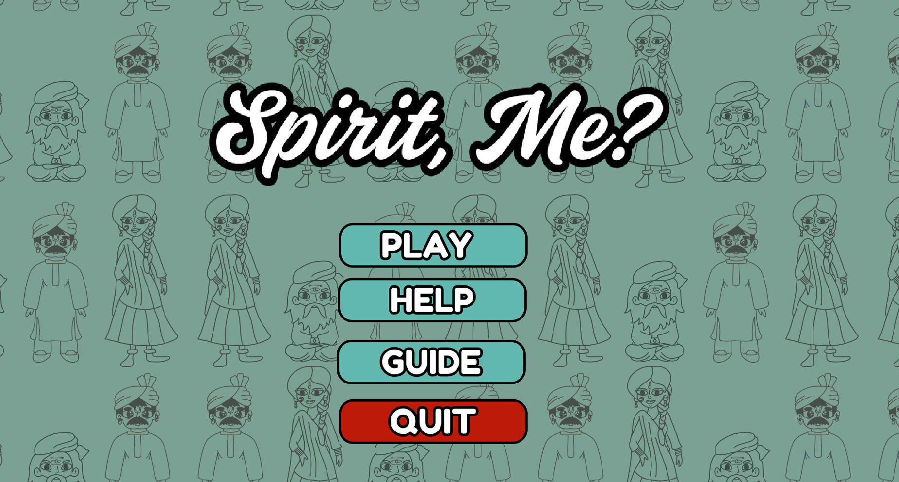
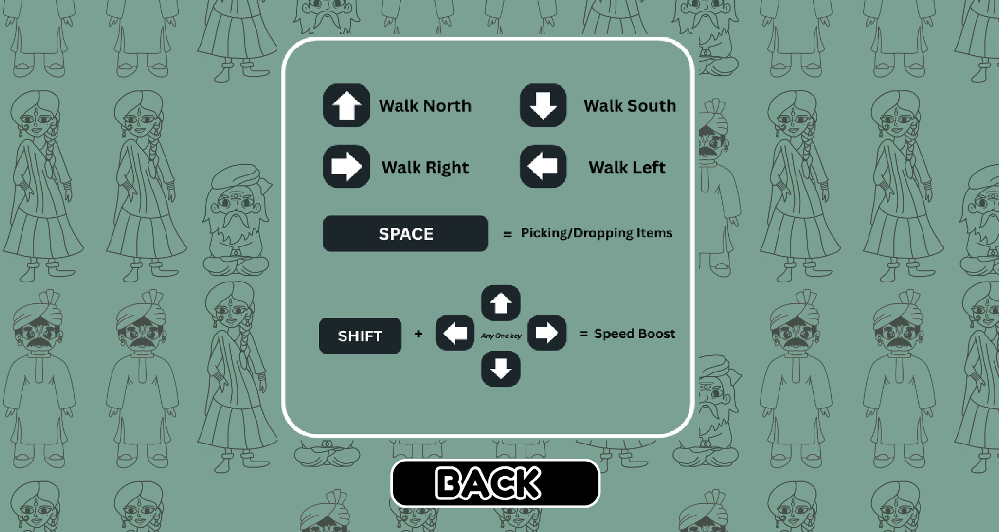
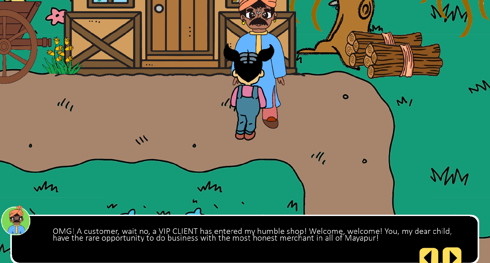

# 🌸 Spirit, Me? — A Choice-Based RPG Game
“Spirit, Me?” is a narrative-driven, interactive RPG where you play as Chutki, a curious and kind-hearted character who helps NPCs by finding their lost items. Once helped, the NPCs transform into their animal spirit forms, inspired by Indian folklore and the philosophy of Karma and Moksha.

🎮 **Gameplay Overview:**

- Explore a village filled with hidden clues and interactive characters
- Dialogue-based interactions and hints from NPCs
- Collect and deliver items to progress the storyline
- Watch NPCs transform into animal spirits as you help them
- Aesthetic inspired by Panchatantra tales with cute pixel animations

⚙️ **Built With:**

- GameMaker Studio 2 – for development and animations
- Canva, ibis paint, Figma – for sprite design
- Twine – for narrative structure & Hints
- Figma – for UI mockups and flow planning

📸 **Screenshots:**

## 🎥 Gameplay Demo --> Click on the below image

⭐ **Inspiration:**

The game draws from ancient Indian moral stories and spiritual concepts, aiming to teach empathy and reward helpfulness through storytelling. It’s lighthearted but meaningful.
